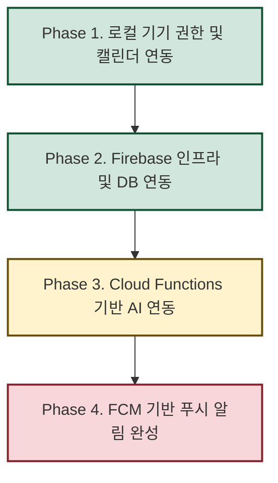

# 마중 (Majung) - Flutter Project

마음의 무게를 덜어주는 대화형 일기 및 마음 케어 솔루션, **마중(Majung)** 플러터 애플리케이션 프로젝트입니다.

---

## 🎨 주요 구현 피처 및 디자인 시스템

1. **Figma 고충실도(High-Fidelity) 이식**
   - 피그마 시안의 16색 감정/테마 완전 반영: 기분 5단계 칩 및 그레이스케일 7단계 스펙트럼 수록 (`lib/theme.dart`).
   - 피그마 규격과 1픽셀 오차도 없는 11종 공통 컴포넌트(Pill 버튼, 비대칭 대화 말풍선, 추천 카드, 세그먼트 슬라이더 등) 개발 완료.
2. **폴더 구조 최적화 및 공통 위젯 추출**
   - 도메인/기능별 관심사 분리를 위해 폴더 구조를 리팩토링하였으며, `DiaryMoodSelectorRow`, `DiaryTitleInputField`, `DiaryContentInputField`, `DiaryEditableImageScrollList` 등의 공통 입력 컴포넌트 격리.
3. **독립적 에셋 관리 및 반응형 인터페이스**
   - 원형 전송 버튼 및 캐릭터 일러스트 등의 크기와 여백을 피그마 원안에 맞추되 기기 가로폭에 유연하게 대응하는 반응형 레이아웃 탑재.

---

## 💾 백엔드/DB 연동 4단계 로드맵 및 인수인계

본 프로젝트는 목업(Mock) 아키텍처에서 안정적으로 실서비스 백엔드로 마이그레이션하기 위해 **총 4단계(Phases)**의 로드맵을 설계하고 순차적으로 이행 중입니다.



### 🟩 진행 완료 단계

#### [완료] Phase 1. 로컬 기기 권한 및 캘린더 연동 (기초 작업)
- **목적**: 기기 내 권한 처리 및 하드웨어 연동을 위한 클라이언트 기반 마련.
- **이행 사항**:
  - `permission_handler` 패키지를 연동하여 온보딩 4단계 또는 일기 작성 시 사진 갤러리/캘린더/알림 권한을 요청하는 프레임워크 구축.
  - `device_calendar`, `timezone` 패키지를 설치하여 모바일 기기 내 달력 앱 일정을 가져올 수 있는 기틀 마련.
- **남은 과제**: 실제 가져온 디바이스 캘린더 일정을 AI 채팅 컨텍스트 프롬프트와 물리적으로 매핑하는 작업 (Phase 3에서 연동 예정).

#### [완료] Phase 2. Firebase 인프라 구축 및 DB 연동 (백엔드 기초)
- **목적**: 목업 데이터를 제거하고 실제 클라우드 데이터베이스(Firestore) 및 인증과 상태를 실시간 연동.
- **이행 사항**:
  - Flutter 프로젝트 내 Firebase Core SDK 연동 및 플랫폼별(`firebase_options.dart`) 세팅.
  - **Firebase 익명 로그인(Anonymous Auth)** 기능 구현 및 앱 진입 시 자동 처리.
  - **Firestore 데이터 모델 및 리포지토리 구축**:
    - 사용자 설정(`UserRepository`), 일기(`DiaryRepository`), 활동(`ActivityRepository`), 알림(`NotificationRepository`), 리포트(`ReportRepository`) 데이터 액세스 계층 구현.
  - **Riverpod 상태 관리 결합**:
    - Firestore의 실시간 쿼리 스트림(`watchDiaries`, `watchReports`, `watchNotifications` 등)을 Riverpod 3.x Notifier에 바인딩하여 데이터 실시간 양방향 싱크 실현.
  - **Failsafe & Mock 모드 지원**:
    - Firebase 기동 실패나 오프라인/샌드박스 상태에서도 앱이 멈추지 않고 로컬 메모리 상태로 작동하는 Fallback 분기 처리(`isFirebaseEnabled` 플래그 관리).

---

### 🟥 향후 진행 단계 (인수인계 포인트)

#### [예정] Phase 3. Cloud Functions 기반 AI 연동 (핵심 비즈니스 로직)
- **목표**: 실제 대화 분석 및 일기 자동 생성, 마중이의 따뜻한 답장(Feedback) 및 기분별 추천 행동(Action)을 생성하는 서버리스 백엔드 연동.
- **개발 Task**:
  1. **Firebase Cloud Functions (Node.js/TypeScript 또는 Python) 서버 구축**:
     - 클라이언트로부터 대화 기록 배열(`ChatMessage[]`)을 전송받아 OpenAI 또는 Google Gemini API와 연동하는 API 함수 작성.
  2. **AI 프롬프트 엔지니어링**:
     - 사용자의 감정 단계(1~5) 추출, 일기 내용 요약, 대화 분석 기반 답장 템플릿 반환.
     - **캘린더 일정 컨텍스트 주입**: Phase 1에서 획득한 오늘의 기기 일정(예: "PT 발표", "면접")을 AI 프롬프트에 동반 주입하여, *"오늘 면접 보느라 많이 떨렸을 텐데"*처럼 일정 인지형 맞춤 공감 대화를 생성하도록 연동.
  3. **클라이언트 상태 업데이트**:
     - `DiaryLoadingScreen`에서 해당 Functions API를 트리거하여 완료 시 생성된 일기를 Firestore에 저장하고 `DiaryCompletedScreen`으로 라우팅.

#### [예정] Phase 4. FCM 기반 원격 푸시 알림 및 스케줄러 (리텐션 강화)
- **목표**: 유저 맞춤 알림 및 자동 리포트 도착 푸시 알림을 활성화하여 앱 참여 활성화.
- **개발 Task**:
  1. **FCM (Firebase Cloud Messaging) 연동**:
     - iOS APNs 인증서 세팅 및 Android 원격 푸시 수신 핸들러 추가.
     - 로그인/토큰 갱신 시 `Users` 컬렉션의 유저 정보 문서 하단에 `fcmToken` 필드를 자동으로 동기화하는 로직 추가.
  2. **이벤트 기반 Cloud Functions Trigger**:
     - Firestore의 `users/{uid}/reports` 컬렉션에 새 리포트(편지) 문서가 추가(Create)되는 이벤트를 서버에서 감지하여 해당 유저의 `fcmToken`으로 알림 발송.
  3. **시간 예약형 Scheduled Cloud Functions**:
     - 매일 밤 유저가 설정한 시각에 예약 실행되는 크론 잡 함수 개발.
     - 당일 캘린더 일정이 존재함에도 아직 일기를 작성하지 않았을 경우, 일정 내용을 AI가 읽어 리마인드용 맞춤 알림 멘트를 생성해 푸시 발송.

### ⚠️ Firebase 플랫폼 지원 범위 및 콘솔 필수 설정 (필독)

#### 1. 지원 플랫폼 범위 및 Failsafe 동작
- 본 프로젝트의 Firebase 설정은 **안드로이드(Android), iOS, 웹(Web/Chrome)** 환경용으로 세팅되어 있습니다.
- macOS 데스크톱 빌드 등 그 외 환경에서는 Firebase 연동이 비활성화되며, 자동으로 **Failsafe Mock 모드(로컬 메모리 모드)**로 격하되어 정상 작동합니다. 실기기 테스트 및 최종 배포 시에는 iOS/Android/웹 환경의 빌드를 이용하십시오.

#### 2. Firebase 콘솔 필수 설정 체크리스트
유저의 조작(일기 저장, 이름 설정 등)이 백엔드와 정상 동기화되기 위해 Firebase Console에서 반드시 다음 설정을 켜주어야 합니다:
- **Authentication (인증)**:
  - `익명 (Anonymous)` 로그인 제공업체를 **사용 설정(Enabled)**으로 켜주셔야 합니다. (미설정 시 로그인 실패로 인해 앱이 자동으로 Mock 모드로 전환되어 작동합니다.)
- **Cloud Firestore (데이터베이스)**:
  - 데이터베이스 생성 후, 보안 규칙(Rules)이 아래와 같이 지정되어 있어야 정상 동작합니다. 익명 로그인 유저가 생성한 본인 폴더의 문서만 접근할 수 있도록 보안을 적용합니다:
    ```javascript
    rules_version = '2';
    service cloud.firestore {
      match /databases/{database}/documents {
        match /users/{userId}/{document=**} {
          allow read, write: if request.auth != null && request.auth.uid == userId;
        }
      }
    }
    ```
- **Cloud Messaging (푸시 알림 - Phase 4)**:
  - 푸시 수신을 위해 Firebase 콘솔 프로젝트 설정의 '클라우드 메시징' 탭에서 iOS APNs 인증 키 등록(.p8 파일 업로드) 및 Android SHA 인증서 지문 등록이 진행되어야 합니다.

#### 3. 인수자(차기 개발자) Firebase 권한 추가 안내
다음 개발자가 Firebase 콘솔에 직접 접속해 Firestore 데이터베이스 상태를 확인하고, **Phase 3 & 4의 Cloud Functions(백엔드) 및 FCM 설정을 완료하여 배포(`firebase deploy`)**하기 위해서는 Firebase 프로젝트에 대한 공동 작업자(IAM) 권한이 추가로 주어져야 합니다:
1. **Firebase Console** (https://console.firebase.google.com/) 접속.
2. 좌측 상단 톱니바퀴 아이콘 ⚙️ 클릭 -> **프로젝트 설정 (Project Settings)** 이동.
3. 상단 탭 중 **사용자 및 권한 (Users and permissions)** 선택.
4. **사용자 추가 (Add member)** 버튼 클릭.
5. 인수받을 개발자의 구글 이메일을 입력한 후, 역할을 **`편집자(Editor)`** 또는 **`소유자(Owner)`**로 지정하여 추가합니다. (Functions 배포 권한 및 보안 규칙 편집을 위해서는 최소 '편집자' 권한이 필수입니다.)
6. 초대 이메일 발송 후 수락을 받으면 콘솔 조작 권한 인수인계가 완료됩니다.

---

## 🛠️ 주요 아키텍처 및 폴더 구조 참고

```
lib/
├── models/             # 일기, 활동, 알림, 리포트 등의 불변 데이터 모델
├── providers/          # Riverpod 3.0 Notifier 기반 상태 관리 (UI와 완전히 격리됨)
├── repositories/       # Firestore 및 익명 인증 데이터 통신 모듈
├── utils/              # 날짜 포맷, 폼 검증 헬퍼, 말투 사전(SpeechDictionary)
├── widgets/            # 커스텀 토글, 버튼, 다이얼로그 등 재사용 위젯
└── screens/            # 피처별 독립된 화면 뷰 레이어
    ├── calendar/       # 캘린더 화면 피처
    ├── chat/           # AI 대화방, 직접 쓰기, 일기 완료/로딩 피처
    ├── report/         # 우편함 및 주간/월간 리포트 상세 피처
    └── onboarding/     # 로컬 정보 수집 및 6단계 온보딩 시퀀스 피처
```

- **말투 일괄 제어 (`lib/utils/speech_dictionary.dart`)**:
  - 존댓말(높임말) 및 반말 설정에 따라 시스템 얼럿, 타이틀 헤더, 안내 메시지가 동적으로 변환되도록 일원화 관리 중입니다. 
  - 신규 고정 다이얼로그나 안내 추가 시 반드시 `SpeechKey`를 신설하고 `SpeechDictionary`에 사전 정의해 분기를 없애십시오.