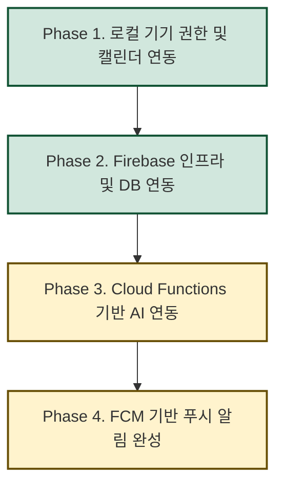

# 마중 (Majung) - Flutter Project

마음의 무게를 덜어주는 대화형 일기 및 마음 케어 솔루션, **마중(Majung)** 플러터 애플리케이션 프로젝트입니다.

---

## 🎨 주요 구현 피처 및 디자인 시스템

1. **Figma 고충실도(High-Fidelity) 이식**
   - 피그마 시안의 16색 감정/테마 완전 반영: 기분 5단계 칩 및 그레이스케일 7단계 스펙트럼 수록 (`lib/theme.dart`).
   - 피그마 규격과 1픽셀 오차도 없는 11종 공통 컴포넌트(Pill 버튼, 비대칭 대화 말풍선, 추천 카드, 세그먼트 슬라이더 등) 개발 완료.
2. **폴더 구조 최적화 및 공통 위젯 추출**
   - 도메인/기능별 관심사 분리를 위해 폴더 구조를 리팩토링하였으며, `DiaryMoodSelectorRow`, `DiaryTitleInputField`, `DiaryContentInputField`, `DiaryEditableImageScrollList` 등의 공통 입력 컴포넌트 격리.
3. **독립적 에셋 관리 및 반응형 인터페이스**
   - 원형 전송 버튼 및 캐릭터 일러스트 등의 크기와 여백을 피그마 원안에 맞추되 기기 가로폭에 유연하게 대응하는 반응형 레이아웃 탑재.

---

## 💾 백엔드/DB 연동 4단계 로드맵 및 인수인계

본 프로젝트는 목업(Mock) 아키텍처에서 안정적으로 실서비스 백엔드로 마이그레이션하기 위해 **총 4단계(Phases)**의 로드맵을 설계하고 순차적으로 이행 중입니다.



---

### 🟩 진행 완료 단계

#### [완료] Phase 1. 로컬 기기 권한 및 캘린더 연동

- **목적**: 기기 내 권한 처리 및 하드웨어 연동을 위한 클라이언트 기반 마련.
- **이행 사항**:
  - `permission_handler` 패키지를 연동하여 온보딩 4단계 또는 일기 작성 시 사진 갤러리/캘린더/알림 권한을 요청하는 프레임워크 구축 (`lib/utils/permission_manager.dart`).
  - `device_calendar`, `timezone` 패키지 설치 및 디바이스 캘린더 일정을 Firestore(`todayEvents`, `todayEventsDate`)에 자동 동기화하는 로직 완성 (`lib/services/fcm_service.dart` 내 `syncDeviceCalendarToFirestore()`).
  - 가져온 오늘의 일정이 Gemini AI 프롬프트 컨텍스트에 자동 주입되어, 맞춤 공감 대화 생성 파이프라인 완성.

#### [완료] Phase 2. Firebase 인프라 구축 및 DB 연동

- **목적**: 목업 데이터를 제거하고 실제 클라우드 데이터베이스(Firestore) 및 인증과 상태를 실시간 연동.
- **이행 사항**:
  - Flutter 프로젝트 내 Firebase Core SDK 연동 및 플랫폼별(`firebase_options.dart`) 세팅 완료.
  - **Firebase 익명 로그인(Anonymous Auth)** 기능 구현 및 앱 진입 시 자동 처리.
  - **Firestore 데이터 모델 및 리포지토리 구축** (`lib/repositories/`):
    - `UserRepository`, `DiaryRepository`, `ActivityRepository`, `NotificationRepository`, `ReportRepository` — 5종 데이터 액세스 계층 전부 구현.
  - **Riverpod 3.x 상태 관리 결합** (`lib/providers/`):
    - Firestore 실시간 쿼리 스트림(`watchDiaries`, `watchReports`, `watchNotifications` 등)을 Riverpod Notifier에 바인딩하여 데이터 양방향 싱크 실현.
  - **Failsafe & Mock 모드 지원**:
    - Firebase 기동 실패나 오프라인 상태에서도 로컬 메모리 상태로 작동하는 Fallback 분기 처리(`isFirebaseEnabled` 플래그).

---

### 🟨 부분 완료 단계 (인수인계 포인트)

#### [코드 완성 / 배포 미완] Phase 3. Cloud Functions 기반 AI 연동

- **현황**: Cloud Functions TypeScript 코드 및 클라이언트 연동 코드가 **모두 작성 완료**되었으나, Gemini API 키 등록 및 Firebase 배포가 아직 실행되지 않은 상태입니다. 현재 앱은 로컬 Ollama(`qwen2.5:7b`) 기반으로 대화 및 일기 생성을 테스트 중입니다.

- **구현 완료 사항**:
  1. **`functions/src/index.ts` — Cloud Functions 4종 작성 완료**:
     - `chatWithMascot` (HTTPS Callable): 대화 기록 배열 수신 → Gemini API 호출 → `reply`, `shouldRecommendActions`, `recommendedActions[]` JSON 반환.
     - `generateDiaryAndFeedback` (HTTPS Callable): 대화 기록 또는 직접 쓰기 데이터 수신 → 일기 본문, 기분(1~5), 마중이 답장, 추천 행동 3개 생성.
     - `onDiaryCreated` (Firestore Trigger): 일기 문서 생성 이벤트 → FCM 푸시 발송 + `notifications` 컬렉션 저장.
     - `onReportCreated` (Firestore Trigger): 리포트 문서 생성 이벤트 → FCM 푸시 발송.
     - `dailyDiaryReminder` (Scheduled, 매일 20:00 KST): 미작성 유저 감지 → 캘린더 일정 기반 맞춤 리마인드 푸시 발송.
  2. **`lib/services/gemini_service.dart` — 이중 경로(Dual-Path) 아키텍처**:
     - `isCloudFunctionsEnabled = true`이면 Firebase Cloud Functions 엔드포인트 호출.
     - `isCloudFunctionsEnabled = false`이면 로컬 Ollama(`localhost:11434`) 호출 (개발/테스트용 Fallback).
  3. **AI 프롬프트 엔지니어링**:
     - 캘린더 일정 컨텍스트 주입 (예: "오늘 면접이 있으셨군요, 많이 긴장되셨을 텐데...").
     - 존댓말/반말 말투 완전 분리, 이모지 금지, 한국어 전용 응답 규격 적용.
     - 응답 JSON Schema 검증으로 구조 일관성 보장.

- **남은 배포 과제**:
  1. Firebase 콘솔 > 프로젝트 설정 > Secret Manager에서 `GEMINI_API_KEY` 등록.
  2. `firebase deploy --only functions` 실행으로 4종 함수 배포.
  3. `lib/main.dart`의 `isCloudFunctionsEnabled = false` → `true` 로 변경.
  4. 실제 Gemini API로 `chatWithMascot`, `generateDiaryAndFeedback` 엔드포인트 통합 테스트.

#### [코드 완성 / 디바이스 테스트 미완] Phase 4. FCM 기반 원격 푸시 알림

- **현황**: FCM 서비스 코드 및 Cloud Functions 트리거(Phase 3 포함)가 **모두 작성 완료**되었으나, iOS APNs 인증서 등록 및 실기기 통합 테스트가 아직 진행되지 않은 상태입니다.

- **구현 완료 사항**:
  1. **`lib/services/fcm_service.dart` — FCM 클라이언트 완성**:
     - 앱 실행 시 FCM 토큰 자동 발급 → Firestore `users/{uid}.fcmToken` 동기화.
     - 토큰 갱신 자동 감지 및 업데이트.
     - 포그라운드 FCM 메시지 수신 핸들러: `notifications` 컬렉션에 자동 저장.
  2. **Cloud Functions 이벤트 트리거** (Phase 3 코드에 포함):
     - 일기/리포트 생성 시 서버에서 자동 FCM 푸시 발송.
     - 매일 20:00 KST 미작성 유저 대상 스케줄드 리마인더.

- **남은 배포 과제**:
  1. Firebase 콘솔 > 클라우드 메시징 탭 > iOS APNs 인증 키(`.p8` 파일) 업로드.
  2. Android `google-services.json` SHA 인증서 지문 등록 확인.
  3. 실기기(iOS, Android)에서 FCM 토큰 발급 → 푸시 수신 통합 테스트.
  4. 주간/월간 리포트 자동 생성 Cloud Function 추가 개발 (현재 미구현: 리포트는 수동으로 Firestore에 직접 등록해야 함).

---

### ⚠️ Firebase 플랫폼 지원 범위 및 콘솔 필수 설정 (필독)

#### 1. 지원 플랫폼 범위 및 Failsafe 동작
- 본 프로젝트의 Firebase 설정은 **안드로이드(Android), iOS, 웹(Web/Chrome)** 환경용으로 세팅되어 있습니다.
- macOS/Windows 데스크톱 빌드 등 그 외 환경에서는 Firebase 연동이 비활성화되며, 자동으로 **Failsafe Mock 모드(로컬 메모리 모드)**로 격하되어 정상 작동합니다. 실기기 테스트 및 최종 배포 시에는 iOS/Android/웹 환경의 빌드를 이용하십시오.

#### 2. Firebase 콘솔 필수 설정 체크리스트
유저의 조작(일기 저장, 이름 설정 등)이 백엔드와 정상 동기화되기 위해 Firebase Console에서 반드시 다음 설정을 켜주어야 합니다:

- **Authentication (인증)**:
  - `익명 (Anonymous)` 로그인 제공업체를 **사용 설정(Enabled)**으로 켜주셔야 합니다. (미설정 시 로그인 실패로 인해 앱이 자동으로 Mock 모드로 전환됩니다.)

- **Cloud Firestore (데이터베이스)**:
  - 데이터베이스 생성 후, 보안 규칙(Rules)이 아래와 같이 지정되어 있어야 정상 동작합니다.
    ```javascript
    rules_version = '2';
    service cloud.firestore {
      match /databases/{database}/documents {
        match /users/{userId}/{document=**} {
          allow read, write: if request.auth != null && request.auth.uid == userId;
        }
      }
    }
    ```

- **Cloud Functions (Phase 3)**:
  - `GEMINI_API_KEY` Secret 등록: Firebase 콘솔 > 프로젝트 설정 > Secret Manager.
  - 배포 명령: `cd functions && npm install && cd .. && firebase deploy --only functions`

- **Cloud Messaging (Phase 4)**:
  - iOS APNs 인증 키(`.p8` 파일) 업로드: Firebase 콘솔 > 프로젝트 설정 > 클라우드 메시징.
  - Android SHA 인증서 지문: Firebase 콘솔 > 프로젝트 설정 > 내 앱 > SHA 인증서 지문 추가.

#### 3. 인수자(차기 개발자) Firebase 권한 추가 안내
다음 개발자가 Firebase 콘솔에 접속하여 Cloud Functions 배포 및 FCM 설정을 완료하려면 Firebase 프로젝트에 대한 공동 작업자(IAM) 권한이 필요합니다:

1. **Firebase Console** 접속 → 좌측 상단 ⚙️ **프로젝트 설정** 이동.
2. 상단 탭 **사용자 및 권한** 선택.
3. **사용자 추가** 버튼 클릭 → 구글 이메일 입력 → 역할 **`편집자(Editor)`** 이상 지정.
4. 초대 이메일 수락 완료 후 콘솔 접속 가능.

---

## 🏗️ 주요 아키텍처 및 폴더 구조

```
lib/
├── main.dart                   # 앱 진입점, Firebase 초기화, 개발용 런처
├── firebase_options.dart       # 플랫폼별 Firebase 설정 (자동 생성)
├── theme.dart                  # 피그마 디자인 토큰 (색상, 타이포그래피)
├── models/                     # 불변 데이터 모델 (일기, 채팅, 활동, 리포트, 알림)
├── providers/                  # Riverpod 3.x Notifier 기반 상태 관리
├── repositories/               # Firestore 데이터 액세스 계층 (6종)
├── services/
│   ├── fcm_service.dart        # FCM 초기화, 토큰 관리, 캘린더 동기화
│   └── gemini_service.dart     # Gemini AI 연동 (Cloud Functions / Ollama Fallback)
├── utils/
│   ├── speech_dictionary.dart  # 존댓말/반말 UI 문자열 일원화 사전
│   ├── calendar_service.dart   # 기기 캘린더 이벤트 동기화
│   ├── permission_manager.dart # 사진/캘린더/알림 권한 처리
│   └── datetime_extension.dart # 날짜 포맷 헬퍼
├── widgets/                    # 재사용 UI 컴포넌트 (버튼, 토글, 카드 등)
└── screens/
    ├── onboarding/             # 6단계 온보딩 시퀀스
    ├── chat/                   # AI 대화방, 직접 쓰기, 일기 완료/로딩
    ├── calendar/               # 월간 달력 뷰 + 일기 프리뷰
    ├── report/                 # 우편함 및 주간/월간 리포트 상세
    ├── home_screen.dart        # 홈 화면 (하단 내비게이션 허브)
    ├── activity_collection_screen.dart  # 추천 행동 라이브러리
    └── notification_screen.dart         # FCM 알림 히스토리

functions/
├── src/index.ts                # Cloud Functions 4종 (TypeScript)
└── package.json                # Node 18, @google/genai, firebase-admin
```

### 말투 일괄 제어 (`lib/utils/speech_dictionary.dart`)
존댓말(높임말) 및 반말 설정에 따라 시스템 얼럿, 타이틀 헤더, 안내 메시지가 동적으로 변환되도록 일원화 관리 중입니다. 신규 고정 다이얼로그나 안내 추가 시 반드시 `SpeechKey`를 신설하고 `SpeechDictionary`에 사전 정의해 분기를 없애십시오.

---

## 📦 주요 패키지 의존성

| 패키지 | 버전 | 역할 |
|--------|------|------|
| `flutter_riverpod` | ^3.3.1 | 상태 관리 |
| `firebase_core` | ^3.1.1 | Firebase 초기화 |
| `cloud_firestore` | ^5.0.1 | Firestore DB |
| `firebase_auth` | ^5.1.1 | 익명 인증 |
| `firebase_messaging` | ^15.0.0 | FCM 푸시 알림 |
| `cloud_functions` | ^5.1.1 | Cloud Functions 호출 |
| `google_generative_ai` | ^0.4.6 | Gemini AI SDK |
| `image_picker` | ^1.1.2 | 사진 갤러리 |
| `device_calendar` | ^4.3.3 | 기기 캘린더 읽기 |
| `convex_bottom_bar` | ^3.2.0 | 하단 내비게이션 바 |
| `flutter_svg` | ^2.0.10 | SVG 에셋 렌더링 |

---

## 🗃️ Firestore 데이터 스키마

```
users/
└── {uid}/                          # 익명 로그인 UID
    ├── name: String
    ├── selectedStyle: int           # 0=반말, 1=존댓말
    ├── notificationEnabled: bool
    ├── fcmToken: String
    ├── todayEvents: List<String>    # 기기 캘린더 동기화
    ├── todayEventsDate: String      # "YYYY.MM.DD"
    ├── diaries/
    │   └── {date}/                  # "2026.06.14", "2026.06.14-1" (하루 최대 3개)
    │       ├── mood: int (1~5)
    │       ├── title, content, mascotFeedback
    │       ├── recommendedActions: List<String>
    │       ├── imagePaths: List<String>
    │       └── isDirectWrite: bool
    ├── activities/
    │   └── {id}/                    # 추천 행동 항목
    │       ├── title: String
    │       ├── isLiked: bool
    │       └── selectedDates: List<String>
    ├── reports/
    │   └── {id}/                    # 주간/월간 리포트
    │       ├── isWeekly: bool
    │       ├── content: Map          # 존댓말/반말 이중 버전
    │       └── recommendations, weeklySummaries, ...
    └── notifications/
        └── {id}/
            ├── title: String
            ├── date: String (ISO)
            └── isUnread: bool
```
